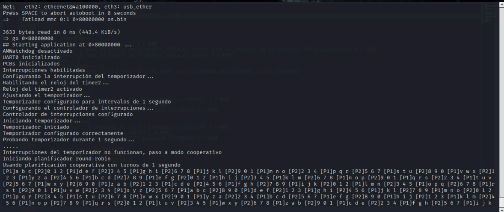

# Bare-Metal OS with Round-Robin Scheduler for BeagleBone Black



## 📖 Overview

This repository contains the source code for a custom, bare-metal operating system for the **BeagleBone Black (Rev C)** single-board computer. Developed as a final project for a Computer Science VII course, this OS demonstrates low-level hardware interaction, process management, and custom scheduling without relying on any existing libraries or kernels.

The core of the project is a stable **cooperative round-robin scheduler** that successfully manages a multi-process environment. The implementation also explores the foundations of preemptive scheduling by configuring hardware timers and interrupt controllers.

---

## ✨ Core Features & Technical Details

*   **Bare-Metal Execution**: The OS runs directly on the hardware after being loaded by the U-Boot bootloader, giving it full control over the system.
*   **Multi-Process Environment**: Manages two concurrent processes, each with its own separate stack and memory space defined in a custom linker script (`linker.ld`).
    *   **Process 1**: Prints the letters 'a' through 'z' in a loop.
    *   **Process 2**: Prints the numbers '0' through '9' in a loop.
*   **Cooperative Round-Robin Scheduler**: The OS kernel manually switches context between the two processes. Each process runs for a simulated time slice before voluntarily yielding control, showcasing a simple and robust scheduling algorithm.
*   **Low-Level Hardware Initialization**: The OS configures critical hardware peripherals from scratch:
    *   **UART0**: Configured for serial communication (115200 baud, 8N1) to display output.
    *   **Watchdog Timer**: Explicitly disabled to prevent unexpected system resets.
    *   **Clock Modules & Timers**: Includes code to configure the DMTimer2 and the AM335x Interrupt Controller (INTC) (This part is not working properly).
*   **Process Control Blocks (PCBs)**: A custom `struct pcb` is used to save and restore the context of each process, including registers, stack pointer, and program counter.

---

## 🛠️ Architecture

The system is structured with a clear separation between the hardware, the OS kernel, and the user processes. The memory map is explicitly defined by a custom linker script (`linker.ld`), which allocates separate, non-overlapping regions in RAM for each component to ensure system stability.

---

## 🔧 Build and Deployment

The project is built using the `arm-none-eabi-gcc` toolchain.

1.  **Prerequisites**: An ARM cross-compiler toolchain (`arm-none-eabi`).
2.  **Build**: Run the build script to compile the C and Assembly source files and link them into a final binary.
    ```bash
    ./build_and_run.sh
    ```
3.  **Deployment**:
    *   Copy the generated `os.bin` file to the root of a bootable SD card.
    *   Insert the SD card into the BeagleBone Black and power it on.
    *   Connect to the board via a serial-to-USB adapter and open a terminal (e.g., Minicom).
    *   In the U-Boot prompt, execute the following commands to load and run the OS:
    ```uboot
    fatload mmc 0:1 0x80000000 os.bin
    go 0x80000000
    ```

---
